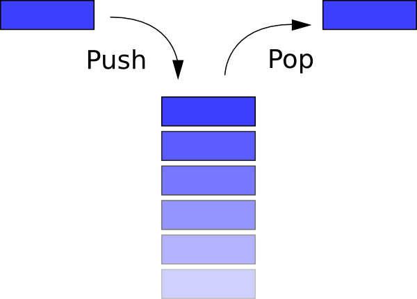

Stack Template Class
===========================
**An implementation and demonstration of a C++ stack template class**

This code is a adaptation of [Lalith Rallabhandi's](https://plus.google.com/+LalithRallabhandi/posts) example located at http://www.techfinite.net/2013/10/program-for-stack-data-structure-in-cpp.html. He includes an explanation of how a stack data structure works.

To use, compile "main.cpp" and "Stack.hpp," then run.  Choose menu item #4 for a demonstration.

**Happy Coding!**
